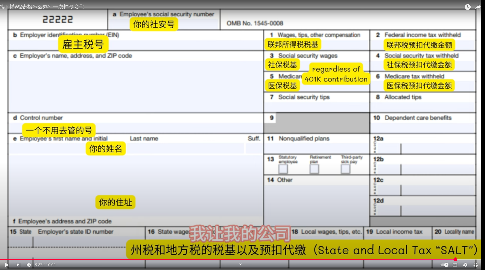

## 前言

今天是 PI 节日，每次 PI 节都是 3 月 14 号，也是如火如荼的报税季节。今年这是我工作第三年，美国报税也有几次了，但我非常讨厌报税，填表格。讨厌的原因有两点，一个是填表格的过程非常繁琐，另一个是填表格结果的正确对于一个完美主义者来说会令人十分令人焦虑。

首先说说这个填表格的过程：每次填表格都是信息检索的过程，首先要理解问题问的是什么，然后在脑子里思考问题的答案是什么，很多时候相同的信息并不会有改变，但是反复在不同的地方填写，实在是浪费时间！

再说说对填表格的结果的焦虑：重要的表格填完了以后还要检查，尤其是对我这样略微带有完美主义倾向的人来说填表格不能出半点差错，如果有点对不上就想研究明白是为什么原因，一研究就进入了兔子洞，研究出来还好，研究不明白则非和自己较劲，非得研究明白才算完，有时候会打扰一晚上的计划和心情。

真希望以后大脑介入芯片的话直接通过 protocol 进行交流，不需要进行无意义的重复信息检索，也不用焦虑结果的差错。

仔细分析为什么我会反感甚至拖延报税，有一个原因就在于自己其实对报税表格的理解不足，如果一个问题是你是明白清晰逻辑的，那么遇到这样的问题自然大脑就觉得很舒适。但如果一个问题你不明白逻辑，搞不清里面的概念，那每次遇到这样的问题就不想作答，就拖延。

毕竟这也不是故意让你填错的表格，设计应该是符合直观逻辑的。但一方面是这样思考，另一方面也承认这个表格的复杂性，我猜测这个表格就像一个代码库，刚开始逻辑清晰简单，但是随着时间的变化，每一届总统，每一个法官都有自己的想法，颁布不同的法案，适应当时的社会状况。随着这些迭代，这种表格必然就有了更复杂的形式。

一个比较好的 growth mindset 就是不会就学，学不懂继续思考，总相信自己能学懂。所以今天想写一下 w2 表格不同格子里具体代表什么内容。

## W2

### 大致

1. w2 表格总结了年度的收入和预缴，FICA，医保，退休，HSA。

### 每个格子

```
a. social security number
b. employer id
c. employ name, address, zip code
d. control number (your id in company)
e. employee's name, address
f. employee's zip code.
```

```
1. wages,tips, other comp, 联邦所得税的税基 （扣除 401k 以后）
2. federal income tax witheld，联邦税预缴
3. social security tax，社保税基 （cap 168600 - 2024），超过的部分不用交 social security tax
4. social security tax withheld 社保税收的预缴，税收是 6.2%
5. medicare wages/tips 医保税基，没有 cap，含 401k
6. medicare tax withheld 医保税收的预缴，1.45%，超过 20 万+0.9%
7. social security tips 小费收入
8. allocated tips 小费收入
9. blank
10. Dependent Care Benefits
11. Nonqualified Plans 给 executive，高管
12. 401k，HSA contribution，etc
13.
14. state disability insurance
15. state 州
16. state wages 工资，和 box 1 不一样，因为 HSA 在 state level 收税，但是在 federal level 不收税
17. state income tax 州税收
```



## reference

1. https://www.youtube.com/watch?v=_FTOcAjmFVs&ab_channel=%E8%B7%9F%E6%88%91%E4%B8%80%E8%B5%B7%E6%9D%A5%E8%B0%88%E9%92%B1
